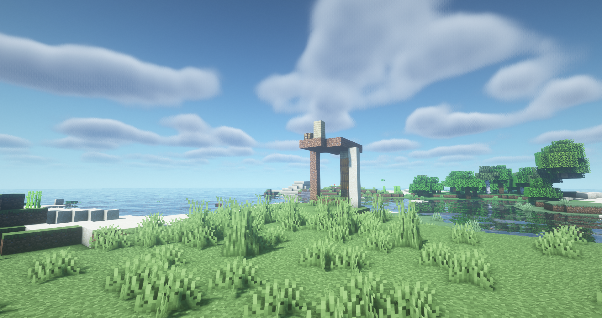

 

  
  <h2 align="center" style="font-weight: 600">XINGMOUREN'S SPRING</h2>

  

    a minecraft vital gallery maker|一个我的世界电子画册生成器
     
    <a href="#" target="blank"><strong>🌎 访问DEMO</strong></a>&nbsp;&nbsp;|&nbsp;&nbsp;
    <a href="#" target="blank"><strong>📦️ 下载安装包</strong></a>&nbsp;&nbsp;|&nbsp;&nbsp;
    <a href="#" target="blank"><strong>💬 加入交流群</strong></a>
     
     
  

# 本项目还没开源,目前源代码在私人仓库,我完成自己的礼物后会开源，预计2014年3月份开源（也有可能不会开源,全看心情owo）
# 目前进度:usa!
## 😒 这是什么？
一个我的世界电子画册生成器,原理类似于AI绘画,程序会提供给你世界各地的旅游景点,或者我自己写好的,你只需要导入皮肤,自定义成就,就可以自动生成多组照片~~但是对电脑算力有要求~~(这是给我好哥们李春迎专门定制的项目,我可能不会对源代码进行大量简易化处理,有能力的可以自己研究)
## ✨ 有什么用？
生成电子画册,用来送人,具体功能有空详细写写。

- ✅ 使用 Vue.js 全家桶开发
- 🔴 可生成100+景点照片
- 📺 支持自定义皮肤
- 📃 支持自定义成就
- 📻 支持调节生成图片质量
- 🚫 支持图片生成尺寸调节
- 💕 可自定义证书认证(可打印)
- 👌 附赠实体电子画册DIY教程
- ❌ 附赠很多开发时为修复的bug
- 🎣 自带编写代码时的谜之操作
- 🛠 更多特性开发中
## 🎃 如何使用？
在座的各位都是成年人了,要学会自己解决问题哦
## 🏅 DEMO

## 🈚后续开发 or 项目维护
我是单纯做出来送人的,没有考虑到维护的问题,如果有大佬or好心人想接管这个项目,欢迎来提交pr或者联系我获取源码owo
