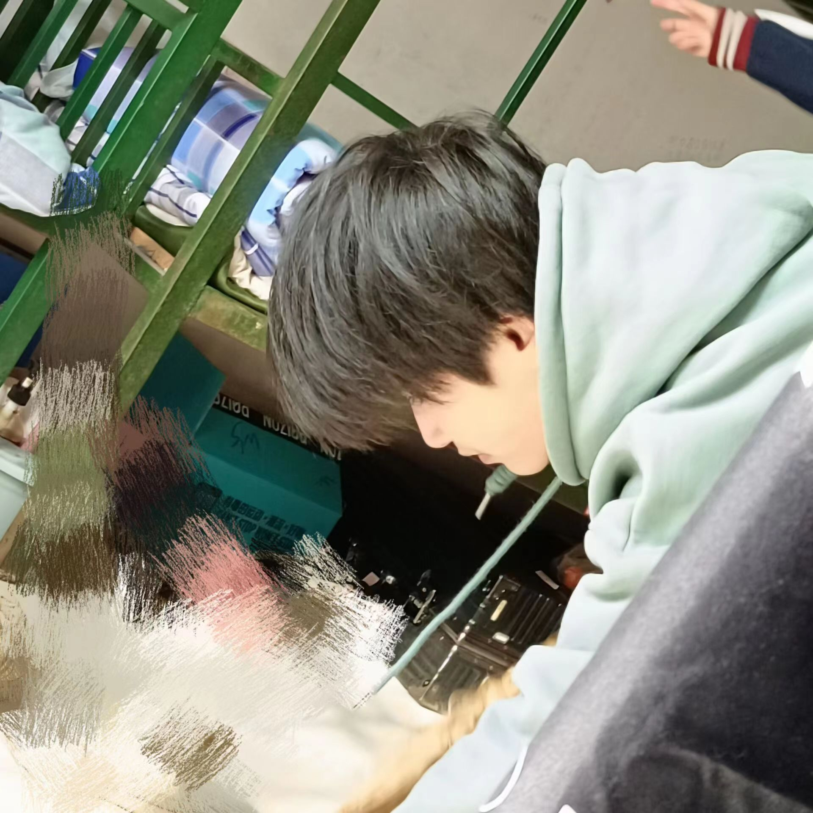

 

  
  <h2 align="center" style="font-weight: 600">XINGMOUREN'S SPRING</h2>

  

    a minecraft vital gallery maker|一个我的世界电子画册生成器
     
    <a href="https://music.qier222.com" target="blank"><strong>🌎 访问DEMO</strong></a>&nbsp;&nbsp;|&nbsp;&nbsp;
    <a href="#%EF%B8%8F-安装" target="blank"><strong>📦️ 下载安装包</strong></a>&nbsp;&nbsp;|&nbsp;&nbsp;
    <a href="https://t.me/yesplaymusic" target="blank"><strong>💬 加入交流群</strong></a>
     
     
  

# 本项目还没开源,目前源代码在私人仓库,我完成自己的礼物后会开源，预计2014年3月份开源~~（也有可能永远也不会开源吧）~~
# 目前进度:重构了日本浅草寺生成逻辑
## 😒 这是什么？
一个我的世界电子画册生成器,原理类似于AI绘画,程序会提供给你世界各地的旅游景点,或者我自己写好的,你只需要导入皮肤,自定义成就,就可以自动生成多组照片~~但是对电脑算力有要求~~(这是一给给我好哥们李春迎专门定制的项目,我可能不会对源代码进行大量简易化处理,有能力的可以自己研究)
## ✨ 有什么用？
生成电子画册,用来送人,具体功能有空详细写写。

- ✅ 使用 Vue.js 全家桶开发
- 🔴 网易云账号登录（扫码/手机/邮箱登录）
- 📺 支持 MV 播放
- 📃 支持歌词显示
- 📻 支持私人 FM / 每日推荐歌曲
- 🚫🤝 无任何社交功能
- 🌎️ 海外用户可直接播放（需要登录网易云账号）
- 🔐 支持 [UnblockNeteaseMusic](https://github.com/UnblockNeteaseMusic/server#音源清单)，自动使用[各类音源](https://github.com/UnblockNeteaseMusic/server#音源清单)替换变灰歌曲链接 （网页版不支持）
  - 「各类音源」指默认启用的音源。
  - YouTube 音源需自行安装 `yt-dlp`。
- ✔️ 每日自动签到（手机端和电脑端同时签到）
- 🌚 Light/Dark Mode 自动切换
- 👆 支持 Touch Bar
- 🖥️ 支持 PWA，可在 Chrome/Edge 里点击地址栏右边的 ➕ 安装到电脑
- 🟥 支持 Last.fm Scrobble
- ☁️ 支持音乐云盘
- ⌨️ 自定义快捷键和全局快捷键
- 🎧 支持 Mpris
- 🛠 更多特性开发中

## 🏅 DEMO

